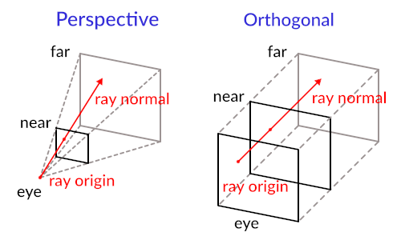

<!--
<p align="center">
  
</p>
-->


## Definition
"We created a 3D enviornment inspired by classics like 'Wolfenstein 3D,' using C and the MiniLibX graphics library. Through raycasting, We built a dynamic 3D environment that blends math, logic, and creativity to create an immersive virtual world. This project deepened our understanding of graphics programming, applying trigonometry, exploring rendering techniques, and focusing on performance optimization. By the end, We had not only learned ray-casting but also developed a polished 3Dgame to showcase my skills."

## Core features
1. **Understanding Ray-Casting**: Learn the fundamentals of ray-casting, a technique used to render 3D scenes by calculating the path of rays from the viewer's perspective and detecting intersections with objects in the environment.
2. **Field of View (FOV)**: Incorporate a 60° FOV to accurately project a 3D view from a 2D grid map.
3. **Grid Mapping**: Transform a given map into a 2D grid and use this to navigate and render the 3D maze.
4. **Intersection Calculations**: Calculate both vertical and horizontal intersections to determine the distances to walls and render the scene accurately.
5. **Rendering Multiple Rays**: Calculate and render multiple rays within the FOV to create a complete and immersive 3D view.

## What i learned

- **Enhanced C**: Deepen the understanding of C programming through practical application.
- **Algorithmic Thinking**: Develop problem-solving skills by implementing complex algorithms for ray-casting and rendering.
- **Graphics Programming**: Gain an introduction to the basics of graphics programming, setting a foundation for more advanced topics in computer graphics and game development.

## How to play

### 1. Prerequisites

- A Unix-based operating system (Linux or macOS).
- Basic knowledge of C and CLI tool.

### 2. Installation

- **Clone the Repository**
- **Navigate to the Project Directory**
- **Build the Project (Compile with "make")**
- **Run**
   ```bash
   ./cub3d maps/long.cub
   ```
- **Instruction how to create map**
   <br>[creat a map](doc/info/creat_map.md)

### 3. Usage

- **Navigate player**: <br>
Use the arrow keys to move `w`, `s`, `a`, `d` <br>
Turn left `arrow left` or right `arrow right`.
- **Exit the Game**:<br>
Press the `ESC` button to quit the game.

## Concept of the Raycasting
To understand raycasting with the Digital Differential Analyzer (DDA), refer to the detailed [raycasting guide](doc/info/Calculation_the_Ray.md).

For a comprehensive raycasting tutorial that utilizes rotation matrices, check out this [raycasting tutorial](https://lodev.org/cgtutor/raycasting.html).

---
## Example

<p align="center">
  
</p>
