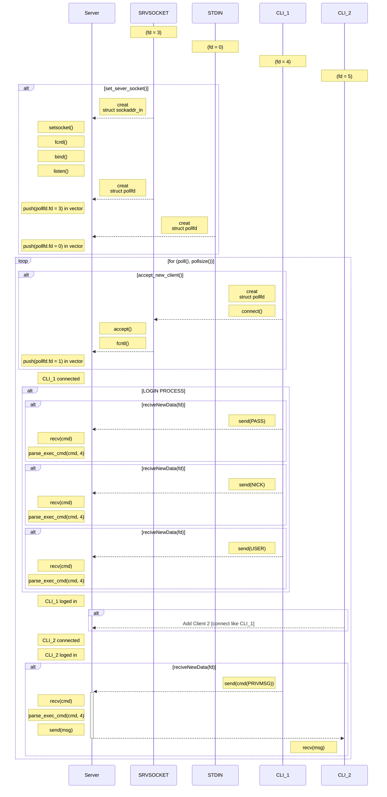

[main](/)

---
# Chatserver Overview

```mermaid

sequenceDiagram
    participant Server
    participant SRVSOCKET
    participant STDIN
    participant CLI_1
    participant CLI_2

    Note over SRVSOCKET: (fd = 3)
    Note over STDIN: (fd = 0)
    Note over CLI_1: (fd = 4)
    Note over CLI_2: (fd = 5)

alt set_sever_socket()
    Note left of SRVSOCKET: creat <br/> struct sockaddr_in
    
    SRVSOCKET-->>Server: 
    Note left of Server: setsocket()
    Note left of Server: fcntl()
    Note left of Server: bind()
    Note left of Server: listen()
    Note left of SRVSOCKET: creat <br/> struct pollfd
    SRVSOCKET-->>Server: 
    Note left of Server: push(pollfd.fd = 3) in vector
    Note left of STDIN: creat <br/> struct pollfd
    participant STDIN
    STDIN-->>Server: 
    Note left of Server: push(pollfd.fd = 0) in vector
end
loop for (poll(), pollsize())
    
    alt accept_new_client()
        participant CLI_1
        Note left of CLI_1: creat <br/> struct pollfd
        Note left of CLI_1: connect()
        CLI_1-->>SRVSOCKET: 
        Note left of SRVSOCKET: accept()
        Note left of SRVSOCKET: fcntl()
        SRVSOCKET-->>Server:   
        Note left of Server: push(pollfd.fd = 1) in vector
        
    end
    Note left of Server: CLI_1 connected
    alt LOGIN PROCESS
        alt reciveNewData(fd)
            Note left of CLI_1: send(PASS)
            CLI_1-->>Server: 
            Note left of Server: recv(cmd)
            Note left of Server: parse_exec_cmd(cmd, 4)  
        end
        alt reciveNewData(fd)
            Note left of CLI_1: send(NICK)
            CLI_1-->>Server: 
            Note left of Server: recv(cmd)
            Note left of Server: parse_exec_cmd(cmd, 4)     
        end
        alt reciveNewData(fd)
            Note left of CLI_1: send(USER)
            CLI_1-->>Server: 
            Note left of Server: recv(cmd)
            Note left of Server: parse_exec_cmd(cmd, 4)      
        end
    end
    Note left of Server: CLI_1 loged in
    alt 
        CLI_2-->>Server: Add Client 2 [connect like CLI_1]
    end
    Note left of Server: CLI_2 connected
    Note left of Server: CLI_2 loged in
    alt reciveNewData(fd)
        Note left of CLI_1: send(cmd(PRIVMSG))
        CLI_1-->>+Server: 
        Note left of Server: recv(cmd)
        Note left of Server: parse_exec_cmd(cmd, 4) 
        Note left of Server: send(msg)
        Server-->>-CLI_2: 
        Note left of CLI_2: recv(msg)
    end
end

    
```