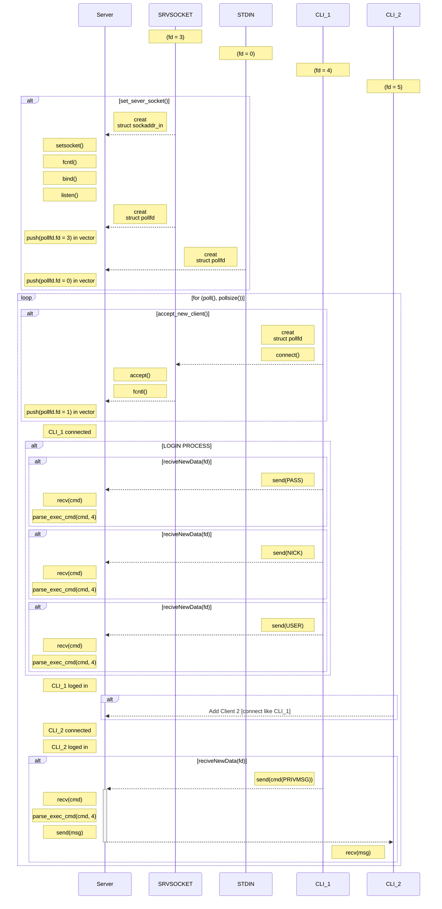

# ft_irc
## Definition
ft_irc is a C++ implementation of an Internet Relay Chat(IRC) server and client developed as part of 42 School's curriculum. It adheres to core standards from [RFC 1459](https://www.rfc-editor.org/rfc/rfc1459.html), enabling real-time text communication through a distributed network architecture.

## Core Features
### 1. Server Architecture
- Handles concurrent client connections using multi-threaded design
- Supports multiple simultaneous users with non-blocking I/O
- Implements user authentication and registration system

### 2. Channel Operations
- Creates/manages IRC channels with join/part commands
- Broadcasts messages to all channel members
- Supports channel-specific modes and topics

### 3. Communication
- Processes standard IRC commands: JOIN, PRIVMSG, NICK, PART
- Enables private messaging between users
- Manages user nicknames and channel membership

### 4. Technical Implementation
- Built using C++98 standard with socket programming
- Includes error handling for network operations
- Maintains connection states using non-blocking sockets

## What i learned
1. [poll()](DOC/poll().md)
2. [socket](DOC/<socket.h>.md)
3. [lock](DOC/overview.md)



## Usage
``` bash
./ircserv <port number> <password>
```
After this, server is running.<br>
Now you should login by using nc(Netcat) tool.
```bash
nc localhost <port number>
```
Authenticate your client following below direction.
```bash
pass <password>
nick <nickname>
user <username> #it should be 4 arguments
```

## Example
#### Run
```bash
./ircserv 1234 hello_is_password
```
#### Connect Netcat
```bash
nc localhost 1234
```
#### Pass, Nick, User name
```bash
pass hello
nick jason
user jason 0 * jason
```

Check out on [Notion]() for the complete IRC project details.